# COLOR-CONVERSION
## AIM
To perform the color conversion between RGB, BGR, HSV, and YCbCr color models.

## Software Required:
Anaconda - Python 3.7
## Algorithm:
### Step1:
Import opencv.

### Step2:
Read the original Image.

### Step3:
Store the required conversion of the image in a variable.


### Step4:
Show the image stored in the given variable.

### Step5:
Destroy all the windows and end the program.

## Program:
```
Developed By: Jegathish S
Register Number: 212221230041
```

### i) Convert BGR and RGB to HSV and GRAY
```
# BGR TO HSV
import cv2
image =cv2.imread('black.jpg')
cv2.imshow('original',image)
b_h=cv2.cvtColor(image,cv2.COLOR_BGR2HSV)
cv2.imshow('BGR_HSV',b_h)
cv2.waitKey(0)
cv2.destroyAllWindows

# BGR TO GRAY
import cv2
image =cv2.imread('black.jpg')
cv2.imshow('original',image)
b_g=cv2.cvtColor(image,cv2.COLOR_BGR2GRAY)
cv2.imshow('BGR_GRAY',b_g)
cv2.waitKey(0)
cv2.destroyAllWindows

# RGB TO HSV
import cv2
image =cv2.imread('black.jpg')
cv2.imshow('original',image)
r_h=cv2.cvtColor(image,cv2.COLOR_RGB2HSV)
cv2.imshow('RGB_HSV',r_h)
cv2.waitKey(0)
cv2.destroyAllWindows

# RGB TO GRAY
import cv2
image =cv2.imread('black.jpg')
cv2.imshow('original',image)
r_g=cv2.cvtColor(image,cv2.COLOR_RGB2GRAY)
cv2.imshow('RGB_GRAY',r_g)
cv2.waitKey(0)
cv2.destroyAllWindows

```

### ii) Convert HSV to RGB and BGR
```
# HSV TO RGB
import cv2
ori=cv2.imread('black.jpg')
cv2.imshow('Original',ori)
h_r=cv2.cvtColor(ori,cv2.COLOR_HSV2RGB)
cv2.imshow('HSV_RGB',h_r)
cv2.waitKey(0)
cv2.destroyAllWindows

# HSV TO BGR
import cv2
ori=cv2.imread('black.jpg')
cv2.imshow('Original',ori)
h_b=cv2.cvtColor(ori,cv2.COLOR_HSV2BGR)
cv2.imshow('HSV_BGR',h_b)
cv2.waitKey(0)
cv2.destroyAllWindows
```

### iii) Convert RGB and BGR to YCrCb
```
# RGB TO YCrCb
import cv2
ori=cv2.imread('black.jpg')
YCrCb_image = cv2.cvtColor(ori, cv2.COLOR_RGB2YCrCb)
cv2.imshow('RGB_YCRCB',YCrCb_image)
cv2.waitKey(0)
cv2.destroyAllWindows

# RGB TO YCrCb
import cv2
ori=cv2.imread('black.jpg')
YCrCb_image = cv2.cvtColor(ori, cv2.COLOR_BGR2YCrCb)
cv2.imshow('BGR_YCRCB',YCrCb_image)
cv2.waitKey(0)
cv2.destroyAllWindows
```
### iv) Split and Merge RGB Image
```
import cv2
img = cv2.imread('black.jpg')
img1= cv2.resize(img, (270,190))
cv2
b,g,r = cv2.split(img1)
cv2.imshow("RED MODEL", r)
cv2.imshow("GREEN MODEL", g)
cv2.imshow("BLUE MODEL ", b)
merger = cv2.merge([b,g,r])
cv2.imshow("MERGED IMAGE", merger )
cv2.waitKey(0)
cv2.destroyAllWindows()
```
### v) Split and merge HSV Image
```
import cv2
img = cv2.imread('black.jpg')
img1= cv2.resize(img, (270,190))
hsv = cv2.cvtColor(img1 , cv2.COLOR_BGR2HSV)
cv2.imshow("INITIAL_HSV ", hsv)
h,s,v = cv2.split(hsv)
cv2.imshow("RED MODEL", h)
cv2.imshow("GREEN MODEL", s)
cv2.imshow("BLUE MODEL ", v)
merger = cv2.merge([h,s,v])
cv2.imshow("MERGED IMAGE", merger )
cv2.waitKey(0)
cv2.destroyAllWindows()
```

## Output:
### Original Image:
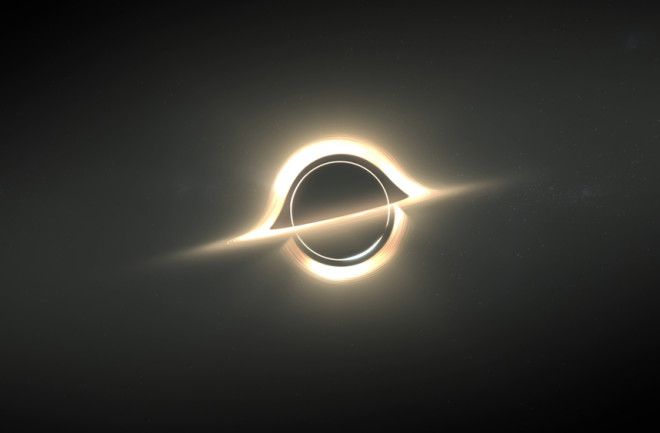
### i) BGR and RGB to HSV and GRAY
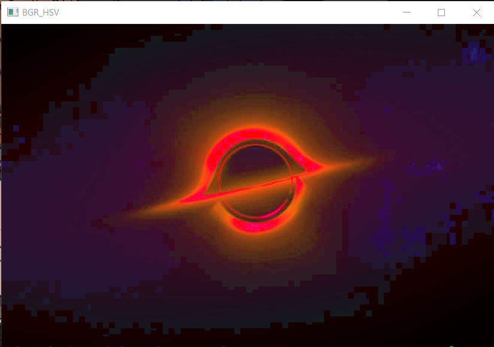
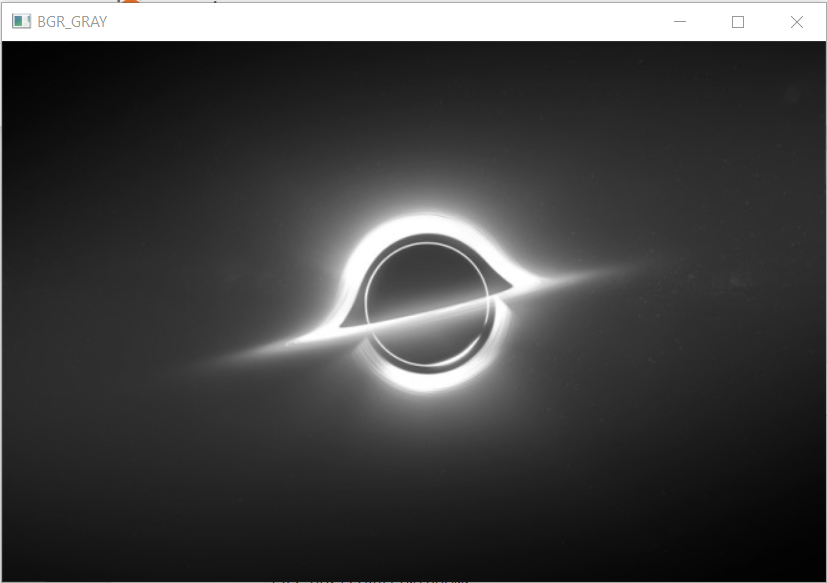
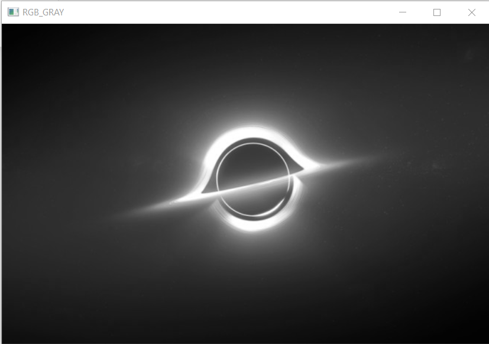
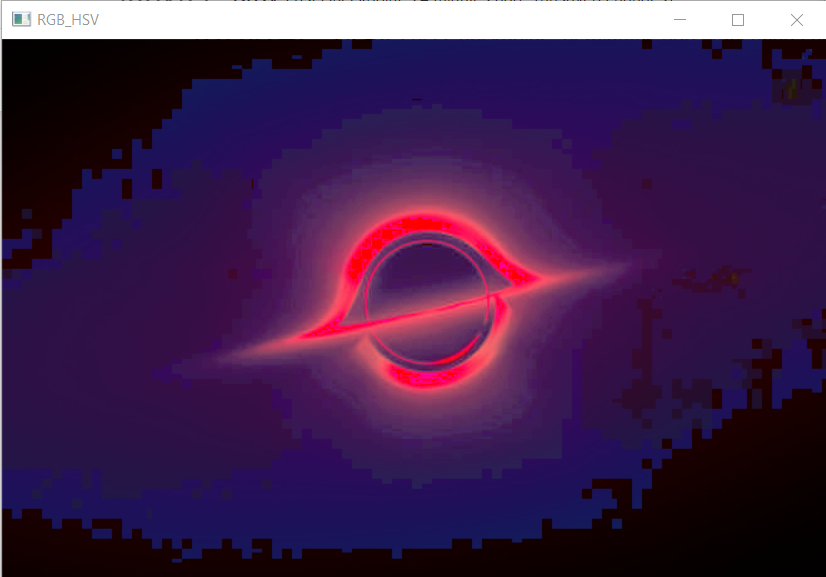
### ii) HSV to RGB and BGR
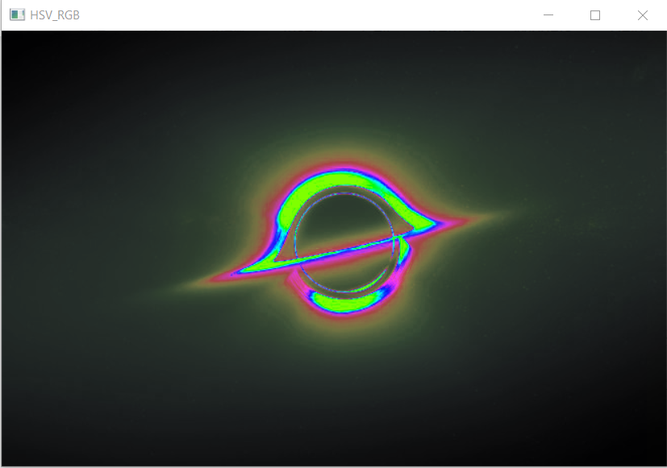
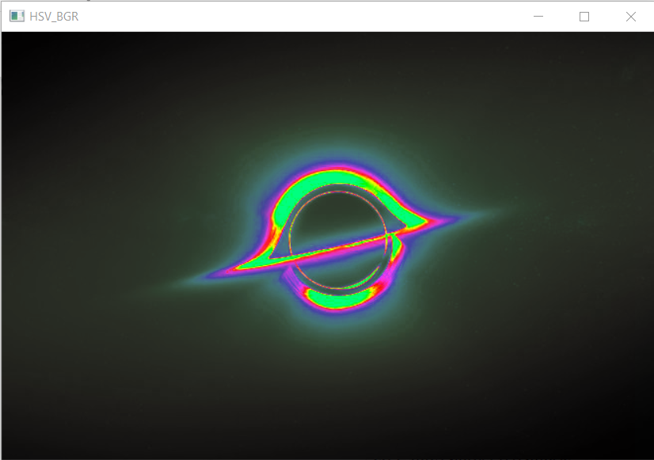


### iii) RGB and BGR to YCrCb
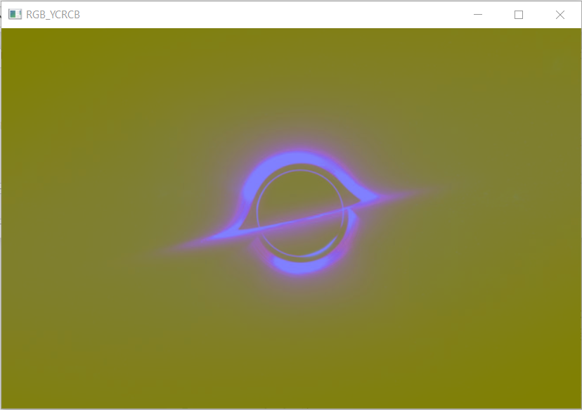
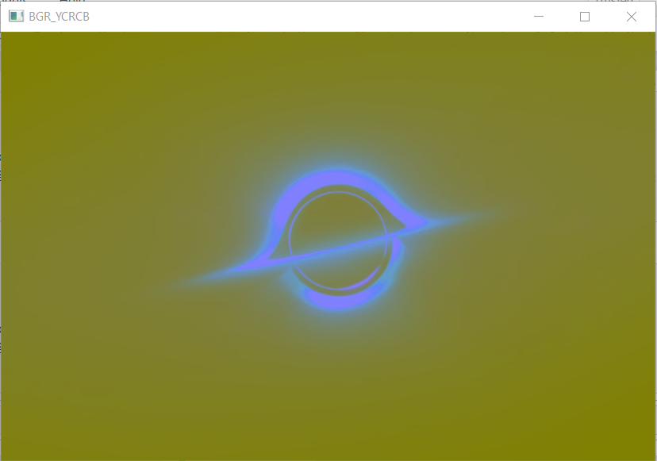
### iv) Split and merge RGB Image
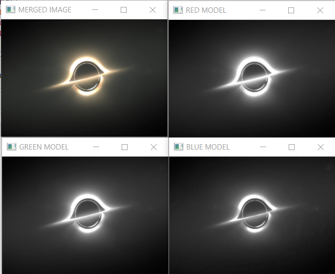
### v) Split and merge HSV Image
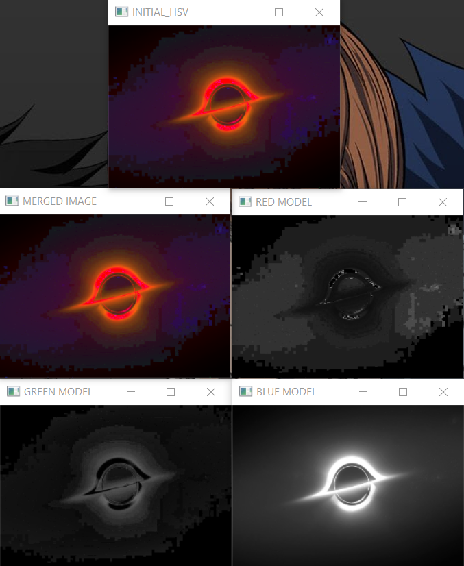

## Result:
Thus the color conversion was performed between RGB, HSV and YCbCr color models.
